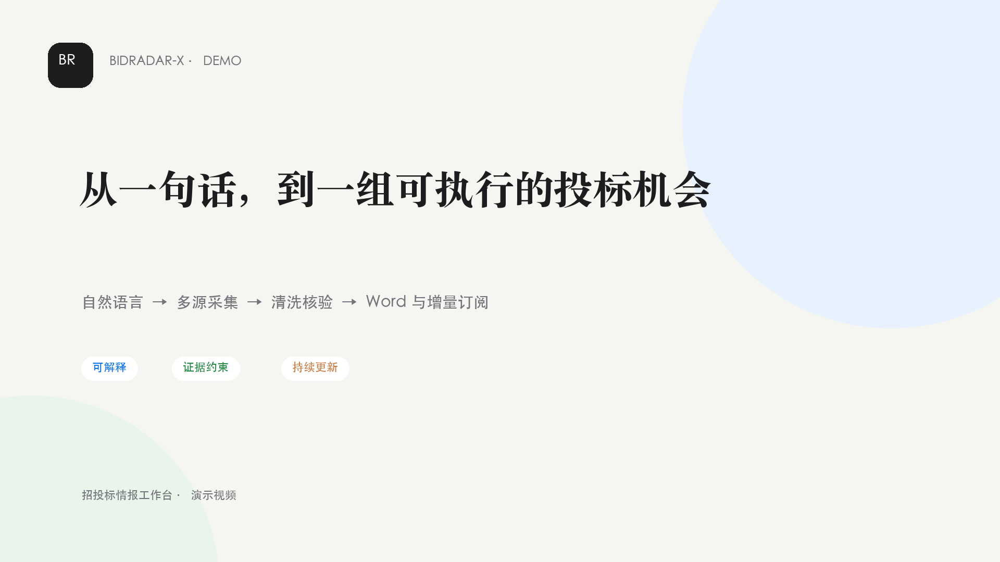
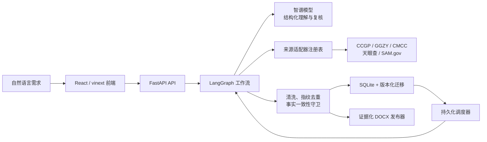

# BidRadar-X

> 从一句自然语言需求，到一组可追溯、可持续更新、可下载 Word 的真实招投标机会。



BidRadar-X 是面向投标团队的 AI 招投标情报工作台。用户只需描述项目主题、地区、时间范围和更新频率，系统会完成需求理解、同义词扩展、多来源检索、清洗查重、事实核验，并为每个项目生成独立的证据化 Word 报告。

本项目不把大模型当作事实数据库：公告标题、发布时间、来源链接、核心原文和附件入口由确定性程序锁定；AI 只负责结构化理解、语义复核、摘要和风险研判，并且必须引用已有证据。

## 评委快速入口

- [中文演示视频](output/demo/BidRadar-X-Demo-zh-CN.mp4)
- [5 分钟安装与验收指南](docs/JUDGE_GUIDE.md)
- [AI 调用链路与密钥安全](docs/AI_PIPELINE.md)
- [Word 报告结构与事实约束](docs/REPORT_FORMAT.md)
- [定时任务与可靠性](docs/SCHEDULED_DELIVERY.md)

## 赛题要求对应关系

| 赛题要求 | BidRadar-X 对应实现 | 当前验证边界 |
|---|---|---|
| 从自然语言识别主题、地区、时间和频率 | AI + 规则双通道提取，输出固定 JSON Schema；显式条件优先于模型推断 | 已接入后端工作流；AI 不可用时安全回退规则链 |
| 信息来自五类互联网来源 | 页面展示政府/公共平台、企业官网/协会、商业聚合、海外平台、新闻资讯五类目录 | 每张卡片明确区分“可采集、需凭据、候选未接入” |
| 至少检索两个网站 | 默认注册中国政府采购网、全国公共资源交易平台、中国移动采购与招标网三个生产适配器 | 外站可能限流或临时不可达；系统展示逐站结果和真实失败原因 |
| 至少一个登录或授权后来源 | 天眼查招投标 API、SAM.gov Opportunities API 支持用户自有 Token/API Key | 凭据仅进入后端环境；中国移动公开公告接口不冒充登录后专属采集 |
| 汇总标题、时间、来源、核心内容、附件 | 每个项目独立生成 DOCX，保留公告事实、原文链接、附件、联系人和条款证据 | 字段缺失时明确显示未知，不补造内容 |
| 核心内容与原文事实一致 | 字段级证据、事实一致性守卫、AI 证据 ID 白名单和 DOCX 回读校验 | AI 结论属于辅助研判，不替代原公告 |

## 核心亮点

### 1. 可解释的 AI 工作流

一次检索被拆为五个可观察阶段：需求理解、检索扩词、多源采集、清洗核验、报告生成。模型输出必须通过结构化 Schema、证据 ID 和确定性阈值校验；限流、超时或非法 JSON 会触发退避、备用凭据切换或规则降级。

### 2. 真实多来源适配层

生产注册表当前包含：

- 中国政府采购网（CCGP）
- 全国公共资源交易平台（GGZY）
- 中国移动采购与招标网（CMCC B2B）
- 天眼查开放平台招投标 API（用户凭据）
- SAM.gov Contract Opportunities（用户凭据）

TED 和中国招标投标协会作为已调研候选来源展示，但尚未注册生产适配器，因此不会被虚假标记为“已采集”。

### 3. 证据约束，而不是“AI 编报告”

系统先把公告和附件转换为统一数据契约，再生成字段级证据。AI 只能围绕输入证据生成摘要、风险、机会与行动建议；项目事实、来源链接和原文片段由程序直接写入 Word。报告生成后会重新打开 DOCX，检查结构、超链接和必需事实。

### 4. 增量订阅与可靠调度

支持“每天 9 点”“每周三下午”“每 3 分钟”等自然语言频率。订阅、租约、重试、下次执行时间和历史结果保存在 SQLite；关闭浏览器不影响任务，后端恢复后可继续扫描到期任务。指纹、水位线和快照用于避免重复推送。

### 5. 面向投标人的决策视图

项目报告不只展示公告正文，还提取采购预算、截止时间、资格资质、保证金、工期、评审办法、联系人和附件状态。界面支持检索历史、项目收藏、定时任务管理、项目 Word 下载和结构化详情。

### 6. 安全与成本边界

- AI Key、Token、Webhook 只从后端环境读取，不进入前端代码、浏览器存储或 Git。
- 付费来源调用前执行原子预算检查，下一次请求可能越过每日上限时直接拒绝。
- 失败来源与空结果分开记录；没有有效项目时不生成空报告、不写入查询历史。
- 飞书多维表格 Outbox 与 CLI 已有代码和自动测试，但企业知识库线上归档仍需企业凭据与权限验收，当前不作为已完成赛题能力宣传。

## 系统架构



## 本地快速启动

要求：Git、Node.js `>=22.13.0`、Python `>=3.11`。

### macOS / Linux

```bash
git clone https://github.com/lshhhhhhhhhh10/BidRadar-X.git
cd BidRadar-X
npm install
python3 -m venv backend/.venv
backend/.venv/bin/python -m pip install --upgrade pip
backend/.venv/bin/python -m pip install -r backend/requirements.txt
cp .env.example backend/.env
npm run dev
```

### Windows PowerShell

```powershell
git clone https://github.com/lshhhhhhhhhh10/BidRadar-X.git
Set-Location BidRadar-X
npm.cmd install
python -m venv backend/.venv
backend/.venv/Scripts/python.exe -m pip install --upgrade pip
backend/.venv/Scripts/python.exe -m pip install -r backend/requirements.txt
Copy-Item .env.example backend/.env
npm.cmd run dev
```

启动后访问：

- 前端：<http://localhost:3000>
- 后端健康检查：<http://127.0.0.1:8000/health>
- AI 状态：<http://127.0.0.1:8000/api/ai/status>
- 来源目录：<http://127.0.0.1:8000/api/sources>

`npm run dev` 会同时启动前后端。本地数据默认保存在仓库的 `.local-data/product/`，该目录已被 Git 忽略。

## 启用 AI

系统没有 AI Key 也能使用规则链；为了体验结构化扩词、语义复核和 AI 报告，请编辑 `backend/.env`：

```dotenv
# 在等号后填写你自己的智谱 API Key
BIDRADAR_AI_API_KEY=
BIDRADAR_AI_PROVIDER=zhipu
BIDRADAR_AI_MODEL=glm-4.7-flash

# 可选：备用凭据/模型，主调用限流或超时时自动切换
BIDRADAR_AI_SECONDARY_API_KEY=
BIDRADAR_AI_SECONDARY_MODEL=glm-5.2
```

不要把真实密钥写入 `.env.example`，也不要使用 `NEXT_PUBLIC_*` 暴露服务端密钥。修改后重启后端生效。

## 建议演示语句

```text
查找最近三个月全国范围内的服务器采购招标公告
```

```text
每 3 分钟查找一次全国范围内的人工智能采购信息
```

第一条展示完整 AI 检索和 Word 链路；第二条会创建可管理的增量订阅。真实网站当时没有匹配内容时，系统会诚实终止，不制造演示数据。

## 自动验收

```bash
cd backend
.venv/bin/python -m unittest discover -s tests -q
cd ..
npm test
```

当前提交前基线：后端 `198` 项测试通过，前端构建与渲染测试通过。评委可按照 [JUDGE_GUIDE](docs/JUDGE_GUIDE.md) 做页面和 API 黑盒验收。

## 技术栈

- 前端：React 19、Next.js 兼容路由、vinext/Vite、TypeScript
- 后端：FastAPI、Pydantic、LangGraph、Uvicorn
- AI：智谱 Chat Completions、JSON Schema、主备凭据故障切换
- 数据：SQLite、版本化迁移、快照/水位线/Outbox
- 文档：python-docx、外部超链接、生成后回读校验
- 测试：Python unittest、FastAPI TestClient、Node rendered-HTML tests

## 当前边界与后续方向

- 外部网站的可用性不由本项目控制；系统提供重试、限速、故障隔离和可读失败原因，但不承诺第三方永远在线。
- 天眼查和 SAM.gov 必须使用评委或用户自己的合法凭据；仓库不附带共享账号或密钥。
- TED 与中国招标投标协会仍是候选来源，未进入生产检索。
- 飞书企业知识库自动同步归档是下一阶段能力：当前已有多维表格可靠投递底座，尚待企业应用凭据、知识库权限和真实租户联调。
- AI 风险研判是辅助信息，不能替代招标文件、法律审查或人工投标决策。

## 文档索引

- [评委安装与验收](docs/JUDGE_GUIDE.md)
- [AI 工作流](docs/AI_PIPELINE.md)
- [数据契约](docs/DATA_CONTRACT.md)
- [报告格式](docs/REPORT_FORMAT.md)
- [定时任务](docs/SCHEDULED_DELIVERY.md)
- [登录/授权来源](docs/LOGIN_SOURCE_SETUP.md)
- [GitHub 协作](docs/GITHUB_WORKFLOW.md)
- [项目路线图（历史工程审计）](docs/ROADMAP.md)

## License

本仓库用于比赛原型、课程展示与团队研发。第三方网站内容、商标和 API 受各自平台条款约束；部署者应自行确认抓取频率、访问授权和数据使用范围。
