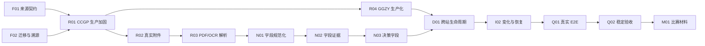

# BidRadar-X 路线图与事实总表

> 历史工程审计说明：本文件的大部分状态冻结于 2026-07-15，用于追溯早期能力编号和证据，不再作为当前比赛交付状态首页。当前能力、安装和验收请以 [README](../README.md)、[评委指南](JUDGE_GUIDE.md) 和 [项目上下文](PROJECT_CONTEXT.md) 为准。

更新时间：2026-07-15（Asia/Shanghai）

本文件是“原始产品构想—历史执行任务—正式能力编号—当前状态”的唯一总映射。未来执行顺序看 [WORK_PLAN](WORK_PLAN.md)，第一次接手看 [TEAM_HANDOFF](TEAM_HANDOFF.md)。

## 产品一句话目标

把分散、变化快且格式不统一的真实招投标公告，转换成有来源、有字段证据、可持续更新的投标决策和招标辅助信息，并交付可查看、可追溯、可下载的 DOCX 报告。

## 用户角色与功能域

- **投标方**：自然语言检索、订阅更新、项目与报告、企业能力匹配、资格与商业决策。
- **招标方**：基于历史相似项目的可解释预算区间和潜在供应商发现。
- **团队/比赛评审**：可重复 Demo、测试证据、设计/架构/操作/部署材料。
- **功能域**：C 治理、F 底座、R 真实来源、N 规范化与证据、D 归并生命周期、I 增量调度、W 报告产品、Q 验收、L 高级产品、M 比赛材料。

## 新能力编号说明

| 字母 | 含义 | 边界 |
|---|---|---|
| C | 项目上下文、协作和治理 | 项目事实、路线图、交接、GitHub 协作 |
| F | 基础契约、存储和可迁移数据底座 | 来源契约、迁移、版本化溯源 |
| R | 真实来源、附件和文档解析 | 公开/授权来源、附件、HTML/PDF/OCR |
| N | 字段规范化、清洗和证据抽取 | 公共字段、需求切片、字段级证据 |
| D | 跨站归并、镜像去重和公告生命周期 | 稳定项目身份和公告关系 |
| I | 增量、变化检测和调度 | 水位线、快照、变化、定时执行 |
| W | Word 报告、下载和历史 | DOCX、项目详情、报告历史/预览 |
| Q | 端到端、稳定性、安全和比赛验收 | 真实链路、部署、恢复与质量门禁 |
| L | 核心数据链完成后的高级产品能力 | 企业画像/RAG/匹配、预算与供应商 |
| M | 演示、设计文档、操作文档和比赛材料 | Demo、报名、演示稿/视频 |

不再创建含义不明确的未来 `TASK-11`、`TASK-12`。旧 TASK 是历史执行批次，新 ID 是长期产品能力；两者不是一对一关系。

## 证据索引

矩阵中的证据代号只用于缩短表格；状态仍以生产代码、测试、日志和入口四类证据共同判断。

| 代号 | 当前证据 |
|---|---|
| E01 | [TASK-01 日志](worklogs/TASK-01-data-contract.md)、[DATA_CONTRACT](DATA_CONTRACT.md)、`backend/app/schemas/` |
| E02 | [TASK-02 日志](worklogs/TASK-02-ccgp.md)、`backend/app/sources/ccgp.py`、CCGP fixture 测试 |
| E03 | [TASK-03 日志](worklogs/TASK-03-ggzy.md)、`backend/app/sources/ggzy.py`、GGZY fixture 测试 |
| E04 | [TASK-04 历史日志](worklogs/TASK-04-login-source.md)、[LOGIN_SOURCE_SETUP](LOGIN_SOURCE_SETUP.md)、`backend/app/sources/tianyancha.py` |
| E05 | [TASK-05 日志](worklogs/TASK-05-docx.md)、[REPORT_FORMAT](REPORT_FORMAT.md)、`backend/app/services/docx_publisher.py` |
| E06 | [TASK-06 日志](worklogs/TASK-06-integration.md)、`backend/app/workflow/`、集成测试 |
| E07 | [TASK-07 日志](worklogs/TASK-07-incremental.md)、`backend/app/services/incremental.py`、增量测试 |
| E08 | [TASK-08 日志](worklogs/TASK-08-scheduler.md)、调度 API/服务/存储和真实 HTTP 黑盒记录 |
| E09 | [TASK-09 日志](worklogs/TASK-09-schedule-intent.md)、自然语言订阅 API/服务和真实 HTTP 黑盒记录 |
| E10 | [TASK-10 日志](worklogs/TASK-10-product-chain.md)、`app/`、项目/报告 API、浏览器与下载黑盒记录 |
| E11 | [F01 日志](worklogs/F01-public-source-contract.md)、[SOURCE_CCGP](SOURCE_CCGP.md) |
| E12 | [F02 日志](worklogs/F02-migratable-storage.md)、`backend/app/storage/`、迁移与存储测试 |
| E13 | [C01 审计日志](worklogs/C01-roadmap-handoff.md)：当前生产代码、125 个隔离后端测试、前端测试和 Git 证据复核 |
| E00 | 当前没有能够支持该能力核心目标的生产证据 |

## 旧执行任务到新能力的映射

| 历史编号 | 当时解决的用户/后端问题 | 主要类型 | 当前判断 | 映射到新能力 | 为什么不是一对一 |
|---|---|---|---|---|---|
| TASK-01 | 以前各来源和报告字段各说各话；完成后后端可用统一公告、证据、需求和报告模型交换数据 | 数据/后端 | 已完成－自动测试验证（契约基础） | F02、N01、W01，并为 I01/I02 提供公共契约 | N01 的全量真实字段和 I02 的完整变化规则尚未完成 |
| TASK-02 | 以前无法读取 CCGP；完成后适配器能搜索、解析并输出统一公告，且有过真实抓取 | 真实来源/后端 | 部分完成 | R01 | 真实抓取不等于全局限速、缓存重试、完整证据和运行持久化等 R01 门禁已满足 |
| TASK-03 | 以前只有一个公开来源；完成后 GGZY 适配器可用 fixture 解析第二来源 | 真实来源/后端 | 部分完成 | R04 | fixture 全绿不等于真实网络可用，R04 还需正式来源契约和黑盒 |
| TASK-04 | 旧剑鱼实验已退役；当前以天眼查开放平台 Token 适配器承接国内授权来源 | 来源/API 适配 | 凭据阻塞 | R05 | 获得用户 Token 后完成真实黑盒验收 |
| TASK-05 | 以前只有结构化数据；完成后后端可生成并校验符合结构的 DOCX | 报告/后端 | 已完成－自动测试验证 | W01、W02 | 该任务没有提供网页下载；下载入口由 TASK-10 完成 |
| TASK-06 | 以前来源、清洗、归并、证据和报告各自独立；完成后形成来源到 DOCX 的纵向集成样板 | 后端/数据/报告/Q | 部分完成 | R01/R04/R05、N01/N02、D01、I01、W02、Q01 | 测试大量使用 fake/fixture；一次真实 CCGP 链路不代表每个横向能力门禁完成 |
| TASK-07 | 以前重复运行无法判断新项目和变化；完成后可保存快照、水位线并做增量交付 | 数据/基础设施 | I01：已完成－自动测试验证；I02：部分完成 | I01、I02 | 新项目核心已验证，但资格/技术变化、完整并发恢复仍欠缺 |
| TASK-08 | 以前不能跨重启保留定时任务；完成后可持久化并按每日/每周/指定时间执行 | 基础设施/后端 | 已完成－真实黑盒验证 | I03 | 真实来源稳定性仍由 R/I/Q 后续能力负责 |
| TASK-09 | 以前用户必须填写调度结构；完成后后端可把自然语言频率解析成订阅 | 后端/产品 | 已完成－真实黑盒验证 | I04 | 首页尚未把聊天输入直接接入订阅 API，是产品体验缺口而非解析核心失败 |
| TASK-10 | 以前报告只能在后端生成；完成后用户可从首页执行、查看项目/详情/历史并下载报告 | 前端/后端/报告 | W03：已完成－真实黑盒验证；Q01：部分完成 | W03、Q01 | **TASK-10 只是产品下载链路完成，不是整个产品完成** |
| F01 | 以前“CCGP 可运行”没有生产定义；完成后建立合规采集、限速、重试、缓存和证据门禁 | 契约/治理 | 已完成－自动测试验证（契约） | F01，为 R01 设门禁 | 是对已有样板的正式契约，不是从头重写采集器 |
| F02 | 以前 SQLite 表结构和溯源不可版本化迁移；完成后有迁移、校验和、运行/公告/证据模型和可靠性测试 | 数据/基础设施 | 已完成－自动测试验证（底座） | F02，并支撑 R/N/I/Q | 是生产加固；当前工作流尚未把全部新存储接口接入真实运行 |

## 原 TASK-11～TASK-14 去向

| 原规划 | 正式去向 | 当前状态 | 恢复说明 |
|---|---|---|---|
| TASK-11 企业画像向导 | L01 | 未开始 | 保留企业名称/行业、资质、能力、地区、项目、团队和风险的分步骤向导 |
| TASK-12 企业知识库与 RAG | **L04** | 未开始 | 独立正式能力，不与当前公告词法检索混淆，也没有折叠成备注 |
| TASK-13 甲方预算估计与供应商推荐 | L02、L03 | 未开始 | 分开验收预算区间/解释与供应商发现/公平性 |
| TASK-14 Demo、设计/操作文档和报名材料 | Q01、Q02、**M01** | Q01：部分完成；Q02/M01：未开始 | 真实链路/稳定性分别归 Q01/Q02；演示、设计、操作、报名和视频素材完整归 M01 |

## 完整功能矩阵

### A. 投标方检索工作台

| 功能 | 新能力 ID | 原始构想来源 | 旧 TASK | 用户可见结果 | 当前状态 | 当前证据 | 完全实现 | 明确缺口 | 前置依赖 | 优先级 |
|---|---|---|---|---|---|---|---|---|---|---|
| Chatbot 输入 | W03/I04 | 投标方聊天框 | TASK-09/10 | 用自然语言描述查询与频率 | 部分完成 | E09/E10/E13 | 否 | 首页可发起查询，但频率没有直接接入订阅 API，理解仍以规则为主 | I04/W03 | P1 |
| 历史查询 | W04 | 左侧历史查询 | TASK-10 | 找回过去查询 | 未开始 | E10/E13 | 否 | 当前项目/报告记录不等于查询历史导航 | W03 | P1 |
| 项目分类 | N01/W04 | 左侧项目分类 | TASK-01/10 | 按类别浏览项目 | 部分完成 | E01/E10 | 否 | 有类别字段/筛选样板，无完整分类体验和质量验收 | N01/W03 | P1 |
| 定时查询 | I03/I04/W04 | 定时项目 | TASK-08/09 | 保存每日/每周/指定时间任务 | 部分完成 | E08/E09/E13 | 否 | 后端已黑盒，首页缺订阅入口和项目化管理体验 | I03/I04/W03 | P1 |
| 更新小紫点 | I02/W04 | 项目更新提醒 | TASK-07 | 有实质变化时显示提醒 | 未开始 | E07/E13 | 否 | 无完整前端未读/已读状态和小紫点入口 | I02/W03 | P1 |
| 项目列表 | W03 | 项目工作台 | TASK-10 | 查看持久化项目列表 | 已完成－真实黑盒验证 | E10/E13 | 是 | 后续仅扩充字段与筛选 | W02/I01 | P0 |
| 项目详情 | W03 | 项目详情 | TASK-10 | 查看项目与关联报告 | 已完成－真实黑盒验证 | E10/E13 | 是 | 决策字段完整度由 N03/L 能力扩展 | W03 | P0 |
| 报告时间线 | W04 | 定时任务持续追加报告 | TASK-08/10 | 按时间查看每次交付 | 未开始 | E08/E10/E13 | 否 | 有报告历史列表，无围绕订阅/变化的完整时间线 | I03/I02/W03 | P1 |
| Word 下载 | W03 | DOCX 交付 | TASK-05/10 | 从网页下载实际 DOCX | 已完成－真实黑盒验证 | E05/E10/E13 | 是 | 报告内容质量随 N/R 提升 | W02 | P0 |
| Word 预览 | W04 | 页面报告预览 | TASK-10 | 不下载也能查看报告 | 未开始 | E13 | 否 | 没有 DOCX/HTML 预览入口 | W03 | P2 |
| 报告历史 | W03 | 持续报告历史 | TASK-10 | 查看一个项目的历史报告记录 | 已完成－真实黑盒验证 | E10/E13 | 是 | 时间线与更新语义仍属 W04 | W02/I01 | P0 |

### B. 真实数据链

| 功能 | 新能力 ID | 原始构想来源 | 旧 TASK | 用户可见结果 | 当前状态 | 当前证据 | 完全实现 | 明确缺口 | 前置依赖 | 优先级 |
|---|---|---|---|---|---|---|---|---|---|---|
| CCGP | R01 | 真实招投标来源 | TASK-02/06、F01/F02 | 查询政府采购公告 | 部分完成 | E02/E06/E11/E12/E13 | 否 | F01 限速/重试缓存/证据/运行持久化门禁未全满足 | F01/F02 | P0 |
| GGZY | R04 | 第二公开来源 | TASK-03/06 | 查询全国公共资源交易公告 | 部分完成 | E03/E06/E13 | 否 | 只有 fixture 成功；真实网络可用性未证明 | R01/F02 | P1 |
| 登录或授权来源 | R05 | 企业/登录来源 | TASK-04/06 | 在合法授权后查询受限来源 | 外部条件阻塞 | E04/E06/E13 | 否 | 缺书面授权、稳定 API/会话和在线黑盒 | 授权/F01 | P3 |
| 真实附件 | R02 | 招标文件与附件 | TASK-06 | 下载原始招标附件 | 未开始 | E13 | 否 | 当前附件源返回模拟正文 | R01 | P0 |
| HTML 解析 | R03 | 网页公告正文 | TASK-02/03/06 | 从详情页抽取正文和字段 | 部分完成 | E02/E03/E06/E13 | 否 | 来源内解析存在，通用错误分类和字段证据不足 | R01/R04 | P0 |
| PDF 解析 | R03 | 招标附件 | TASK-06 | 从 PDF 提取可定位文本 | 未开始 | E13 | 否 | 当前只标注 `pdf_layout`，没有真实 PDF 解析 | R02 | P0 |
| 扫描件 OCR | R03 | 扫描招标文件 | TASK-06 | 从图片/扫描 PDF 提取文字 | 未开始 | E13 | 否 | 当前只标注 `ocr_layout`，没有 OCR 引擎或质量门禁 | R02 | P1 |
| 来源合规 | F01/R01/R04/R05 | 真实来源底线 | F01/TASK-04 | 知道来源许可和访问边界 | 部分完成 | E04/E11/E13 | 否 | CCGP 有契约，GGZY/授权来源还需逐站正式化 | F01 | P0 |
| 限速和重试 | F01/R01/R04 | 稳定采集 | TASK-02/03、F01 | 失败时安全退避且不压垮网站 | 部分完成 | E02/E03/E11/E13 | 否 | 当前实例间非全局；缓存、Retry-After 和失败分类不完整 | F01/F02 | P0 |
| 来源故障隔离 | R01/R04/Q02 | 多来源稳定运行 | TASK-06 | 一个来源失败不毁掉整次任务 | 部分完成 | E06/E13 | 否 | 有错误封装样板，缺真实多来源故障黑盒和告警 | R01/R04 | P1 |

### C. 数据可信与增量

| 功能 | 新能力 ID | 原始构想来源 | 旧 TASK | 用户可见结果 | 当前状态 | 当前证据 | 完全实现 | 明确缺口 | 前置依赖 | 优先级 |
|---|---|---|---|---|---|---|---|---|---|---|
| 数据契约 | F02/N01/W01 | 统一可信数据 | TASK-01、F02 | 模块用相同结构交换公告和报告 | 已完成－自动测试验证 | E01/E05/E12/E13 | 是 | 具体字段仍随 N03 扩展，不否定基础契约 | 无 | P0 |
| 来源 URL | N01/F02 | 可追溯来源 | TASK-01/02、F02 | 每条公告可回到原页面 | 部分完成 | E01/E02/E12/E13 | 否 | 真实附件/重定向与所有来源覆盖不足 | R01/R04 | P0 |
| 字段级证据 | N02/F02 | 可解释结果 | TASK-01/06、F02 | 知道每个字段来自何处 | 部分完成 | E01/E06/E12/E13 | 否 | 存储模型存在，生产采集到报告未全程写入 | R03/N01 | P0 |
| 项目稳定身份 | D01 | 多次运行关联同一项目 | TASK-06/07 | 同一项目不会反复变新项目 | 部分完成 | E06/E07/E13 | 否 | 有指纹规则，缺跨站真实标注与稳定性验收 | N01/R04 | P0 |
| 公告生命周期 | D01 | 招标/变更/中标关联 | TASK-06/07 | 查看项目从公告到结果的演进 | 部分完成 | E06/E07/E13 | 否 | 规则样板存在，真实多公告关系不足 | N02/R04 | P1 |
| 跨站镜像去重 | D01 | 多来源去重 | TASK-06 | 镜像合并但不同公告不误合并 | 部分完成 | E06/E13 | 否 | 有相似度样板，缺真实标注集、阈值和解释验收 | R04/N02 | P1 |
| 来源水位线 | I01 | 增量采集 | TASK-07 | 下次从上次位置继续 | 已完成－自动测试验证 | E07/E13 | 是 | F02 新运行模型接线是后续加固 | N01 | P0 |
| 项目快照 | I01 | 变化追踪 | TASK-07 | 保存每次项目状态 | 已完成－自动测试验证 | E07/E13 | 是 | 字段范围随 N03 扩展 | N01 | P0 |
| 新项目识别 | I01 | 更新交付 | TASK-07 | 只交付真正新增项目 | 已完成－自动测试验证 | E07/E13 | 是 | 跨站稳定身份由 D01 加固 | D01 | P0 |
| 实质变化 | I02 | 更新提醒 | TASK-07 | 只对重要变化提醒 | 部分完成 | E07/E13 | 否 | 预算/截止/采购人等已做，资格/技术/评分变化缺失 | N02/N03 | P1 |
| 并发幂等 | I02/F02 | 调度可靠性 | TASK-07/08、F02 | 重试/并发不重复交付 | 部分完成 | E07/E08/E12/E13 | 否 | 局部约束和租约存在，生产全链恢复黑盒不足 | I01/F02 | P1 |
| 失败恢复 | I02/Q02 | 可运营性 | TASK-07/08 | 进程失败后安全继续 | 部分完成 | E07/E08/E13 | 否 | 有恢复规则/测试样板，无部署级备份恢复演练 | I02/Q01 | P1 |

### D. 投标决策信息

| 功能 | 新能力 ID | 原始构想来源 | 旧 TASK | 用户可见结果 | 当前状态 | 当前证据 | 完全实现 | 明确缺口 | 前置依赖 | 优先级 |
|---|---|---|---|---|---|---|---|---|---|---|
| 项目时间和地点 | N01/N03 | 投标详情 | TASK-01/02/03 | 查看公告时间、截止时间和地区 | 部分完成 | E01/E02/E03/E13 | 否 | 基础字段存在，来源缺失/冲突和详情覆盖不完整 | R01/R04/N01 | P0 |
| 招标内容 | N02/N03 | 投标详情 | TASK-01/06 | 查看采购内容和范围 | 部分完成 | E01/E06/E13 | 否 | 正文清洗存在，附件需求切片与证据不完整 | R03/N02 | P0 |
| 企业能力匹配 | L05 | 投标决策 | 原 TASK-11/12 | 判断企业能否交付 | 未开始 | E00 | 否 | 没有企业画像/知识库与可解释匹配模型 | L01/L04/N03 | P2 |
| 历史中标价格 | N03/L06 | 投标决策 | 原 TASK-13 | 查看可比项目价格证据 | 未开始 | E00 | 否 | 没有可靠历史成交样本归并和可比性规则 | D01/N03 | P2 |
| 预计利润 | L06 | 投标决策 | 原始构想 | 给出带假设和风险的利润区间 | 未开始 | E00 | 否 | 没有企业成本、报价假设和不确定性模型 | L01/N03/Q02 | P3 |
| 资格是否满足 | L05 | 投标决策 | 原 TASK-11/12 | 显示满足/不满足/无法判断 | 未开始 | E00 | 否 | 只有词法相似样板，无资格规则与企业证据 | L01/L04/N03 | P2 |
| 资格覆盖或等价判断 | L05 | 不能只字符串匹配 | 原 TASK-11/12 | 解释已有资质是否覆盖或等价 | 未开始 | E00 | 否 | 缺资质本体、等价规则、依据和人工复核 | L01/L04/N03 | P2 |
| 招标公司商业背景 | N03/L06 | 投标决策 | 原始构想 | 查看有来源的采购人/代理背景 | 未开始 | E00 | 否 | 只有名称字段，无授权背景数据和引用 | N03/合规数据 | P3 |
| 交付周期 | N03 | 投标详情 | TASK-01/06 | 查看交付时间要求 | 部分完成 | E01/E06/E13 | 否 | 规则字段样板存在，真实附件证据不足 | R03/N02 | P1 |
| 付款方式 | N03 | 投标详情 | TASK-01/06 | 查看付款节点与条件 | 未开始 | E13 | 否 | 当前公共模型/报告没有完整可信抽取 | R03/N02 | P1 |
| 质保金 | N03 | 投标详情 | TASK-01/06 | 查看质保金额/比例/期限 | 未开始 | E13 | 否 | 缺字段模型、抽取和证据测试 | R03/N02 | P1 |
| 联合投标 | N03 | 投标详情 | TASK-01/06 | 查看是否允许联合体及条件 | 部分完成 | E01/E06/E13 | 否 | 有需求类别样板，真实条款证据覆盖不足 | R03/N02 | P1 |
| 分包 | N03 | 投标详情 | TASK-01/06 | 查看是否允许分包及限制 | 未开始 | E13 | 否 | 缺稳定字段、抽取和报告入口 | R03/N02 | P1 |
| 评分规则 | N03 | 投标详情 | TASK-01/06 | 查看价格/技术/商务评分依据 | 部分完成 | E01/E06/E13 | 否 | 有章节/类别样板，无真实附件完整解析 | R03/N02 | P1 |

### E. 企业能力

| 功能 | 新能力 ID | 原始构想来源 | 旧 TASK | 用户可见结果 | 当前状态 | 当前证据 | 完全实现 | 明确缺口 | 前置依赖 | 优先级 |
|---|---|---|---|---|---|---|---|---|---|---|
| 企业信息向导 | L01 | 企业按钮/分步向导 | 原 TASK-11 | 分步骤录入企业画像 | 未开始 | E00 | 否 | 无前端、API、存储或隐私流程 | Q01 | P2 |
| 企业名称和行业 | L01 | 企业信息 | 原 TASK-11 | 保存基础身份和行业 | 未开始 | E00 | 否 | 无企业领域模型 | L01 | P2 |
| 企业资质 | L01/L05 | 企业信息 | 原 TASK-11 | 保存资质与有效期/证据 | 未开始 | E00 | 否 | 无资质结构、附件和校验 | L01/R03 | P2 |
| 技术、产品、交付能力 | L01 | 企业信息 | 原 TASK-11 | 保存能力清单与证明 | 未开始 | E00 | 否 | 无模型和用户入口 | L01 | P2 |
| 服务地区 | L01 | 企业信息 | 原 TASK-11 | 保存可服务地区 | 未开始 | E00 | 否 | 无模型和匹配逻辑 | L01 | P2 |
| 历史项目 | L01/L04 | 企业信息/知识库 | 原 TASK-11/12 | 保存可引用的历史交付 | 未开始 | E00 | 否 | 无导入、证据或权限边界 | L01/L04 | P2 |
| 团队规模 | L01 | 企业信息 | 原 TASK-11 | 保存人员与容量 | 未开始 | E00 | 否 | 无模型和时间有效性 | L01 | P3 |
| 风险和限制 | L01 | 企业信息 | 原 TASK-11 | 记录不能做和风险约束 | 未开始 | E00 | 否 | 无模型和决策接线 | L01 | P2 |
| 企业知识库 | L04 | 企业按钮 | 原 TASK-12 | 管理企业内部材料 | 未开始 | E00 | 否 | 当前公告词法检索不是企业知识库 | L01/Q02 | P2 |
| 飞书资料接入 | L04 | 飞书比赛/企业资料 | 原 TASK-12 | 在授权下同步飞书文档 | 未开始 | E00 | 否 | 无授权、同步、删除和审计设计 | L04/授权 | P3 |
| 文档索引 | L04 | 企业知识库 | 原 TASK-12 | 对内部文档建立可更新索引 | 未开始 | E00 | 否 | 无分块、向量/混合索引和版本管理 | R03/L04 | P2 |
| RAG | L04 | 企业知识库 | 原 TASK-12 | 检索企业证据并引用回答 | 未开始 | E13 | 否 | 当前 `EvidenceRAG` 是公告词法/字符串相似样板 | L04/Q02 | P2 |
| 企业能力与项目能力匹配 | L05 | 投标决策 | 原 TASK-11/12 | 解释匹配、缺口和无法判断项 | 未开始 | E00 | 否 | 缺企业证据、项目证据、资格规则和评测集 | L01/L04/N03 | P2 |

### F. 招标方能力

| 功能 | 新能力 ID | 原始构想来源 | 旧 TASK | 用户可见结果 | 当前状态 | 当前证据 | 完全实现 | 明确缺口 | 前置依赖 | 优先级 |
|---|---|---|---|---|---|---|---|---|---|---|
| 历史相似项目 | L02 | 招标方场景 | 原 TASK-13 | 查看可比项目与相似依据 | 未开始 | E00 | 否 | 缺高质量成交数据、去重和相似度评测 | D01/N03/Q01 | P2 |
| 预算估计 | L02 | 招标方场景 | 原 TASK-13 | 得到合理预算区间 | 未开始 | E00 | 否 | 无估值模型和样本门槛 | L02 | P2 |
| 置信区间 | L02 | 不能伪造精确值 | 原 TASK-13 | 看到不确定性和样本数量 | 未开始 | E00 | 否 | 无统计校准和拒答门槛 | L02/Q02 | P2 |
| 可解释依据 | L02 | 招标方场景 | 原 TASK-13 | 追溯到相似项目和调整因素 | 未开始 | E00 | 否 | 无证据引用和调整解释 | L02/F02 | P2 |
| 潜在供应商发现 | L03 | 招标方场景 | 原 TASK-13 | 找到可能满足需求的供应商 | 未开始 | E00 | 否 | 无合规供应商库和召回模型 | L02/L01 | P3 |
| 推荐理由 | L03 | 结果可解释 | 原 TASK-13 | 看到能力/地区/历史证据 | 未开始 | E00 | 否 | 无供应商证据模型和评测 | L03/L05 | P3 |
| 数据授权和公平性 | L03/Q02 | 不能伪造或歧视 | 原 TASK-13/14 | 知道数据来源、限制和公平风险 | 未开始 | E00 | 否 | 无授权清单、公平性指标和申诉/修正流程 | Q02/法务边界 | P2 |

### G. 比赛和交付

| 功能 | 新能力 ID | 原始构想来源 | 旧 TASK | 用户可见结果 | 当前状态 | 当前证据 | 完全实现 | 明确缺口 | 前置依赖 | 优先级 |
|---|---|---|---|---|---|---|---|---|---|---|
| 完整 Demo | Q01/M01 | 比赛交付 | 原 TASK-14 | 重复演示真实输入到报告 | 部分完成 | E10/E13 | 否 | 单次 CCGP 链路跑过，不含稳定附件/多来源/部署复现 | R01-R04/N/D/I/W | P1 |
| 测试数据和演示流程 | Q01/M01 | 比赛交付 | 原 TASK-14 | 按脚本稳定演示正常/失败路径 | 部分完成 | E06/E10/E13 | 否 | fixture 存在，无冻结演示包和完整流程脚本 | Q01 | P1 |
| 设计文档 | M01 | 比赛交付 | 原 TASK-14 | 评委理解用户流程与设计取舍 | 部分完成 | E13 | 否 | 有项目文档，尚未形成比赛版设计稿 | Q01 | P2 |
| 架构文档 | M01 | 比赛交付 | 原 TASK-14 | 评委理解模块、数据和边界 | 部分完成 | E13 | 否 | TEAM_HANDOFF 有交接架构，比赛版仍需收口 | Q01/Q02 | P2 |
| 操作文档 | M01 | 比赛交付 | 原 TASK-14 | 新用户能启动和使用产品 | 部分完成 | E13 | 否 | 有开发交接步骤，缺最终部署用户手册 | Q02 | P2 |
| 部署说明 | Q02/M01 | 比赛交付 | 原 TASK-14 | 在目标环境可重复部署 | 未开始 | E13 | 否 | 当前仅本地开发；Windows 产物和环境问题未清零 | Q02 | P1 |
| 失败恢复说明 | Q02/M01 | 比赛交付 | 原 TASK-14 | 数据/进程失败后可操作恢复 | 部分完成 | E07/E08/E13 | 否 | 有零散机制，无部署级备份恢复演练文档 | I02/Q02 | P1 |
| 报名表材料 | M01 | 比赛交付 | 原 TASK-14 | 提交完整报名文本与证据 | 未开始 | E00 | 否 | 尚未撰写/核验 | Q01/Q02 | P2 |
| 演示稿或视频素材 | M01 | 比赛交付 | 原 TASK-14 | 完成路演或视频提交 | 未开始 | E00 | 否 | 尚未制作 | Q01 | P2 |

## 当前关键路径

当前唯一入口是 **R01**。这只是说明下一能力，不是 R01 的实现提示词；C01 不执行 R01。

## 后续高级产品能力

核心数据链完成后再推进：企业画像 `L01`，企业知识库/飞书/RAG `L04`，企业能力与资格等价 `L05`，历史价格与利润 `L06`，招标方预算 `L02` 和供应商发现 `L03`。这样可以避免用低质量数据提前包装高级功能。

## 明确未完成项

- CCGP 尚未满足 F01 全部生产门禁；GGZY 尚无成功真实网络证据；天眼查与 SAM.gov 待用户凭据进行真实验收。
- 真实附件、PDF、扫描件 OCR、完整字段级证据和跨站生命周期尚未完成。
- F02 新运行/溯源存储接口尚未完整接入生产工作流。
- 资格覆盖/等价、企业能力匹配、历史中标价格、预计利润和商业背景尚未完成。
- 企业画像、企业知识库、飞书接入、文档索引和真正的企业 RAG 尚未开始。
- 招标方预算区间、置信度、供应商发现和公平性尚未开始。
- Word 预览、报告时间线、更新小紫点和前端订阅入口尚未完成。
- 可重复比赛 Demo、部署/恢复验收、报名材料和演示素材尚未完成。
- 默认旧数据库可能迁移校验和失败；过长数据目录可能导致报告锁文件失败；TypeScript 有 3 个 Cloudflare 环境类型错误。

## 状态判断规则

1. `已完成－真实黑盒验证`：有生产实现、自动测试、日志、明确入口，并有真实 HTTP/浏览器/文件结果验证核心目标。
2. `已完成－自动测试验证`：同样有生产实现、测试、日志和入口，但当前完成证据主要来自自动测试。
3. `部分完成`：已有生产代码或入口，但关键范围、接线或验收未满足。
4. `原型或实验`：只证明技术可行或离线解析，不承诺产品可用。
5. `外部条件阻塞`：核心推进依赖授权、凭据、网络或外部制度，仓库内无法安全补足。
6. `未开始`：没有支持核心目标的生产实现。
7. `状态无法验证`：现有证据不足且当前环境无法复核。

特别约束：真实抓到一条 CCGP 不等于 R01 全完成；GGZY fixture 不等于真实网络可用；天眼查适配器单元测试不等于已获得用户 Token；DOCX 后端生成不等于网页下载；当前字符串相似检索不等于企业知识库 RAG；一次产品链跑通不等于 Q01/Q02 完成。
