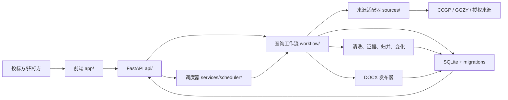

# BidRadar-X 团队交接入口

更新时间：2026-07-15（Asia/Shanghai）

这份文档不依赖任何 Codex 历史聊天。新队员或新的 Codex 任务只要拿到仓库，就应先读本文，再读 [ROADMAP](ROADMAP.md)、[WORK_PLAN](WORK_PLAN.md) 和 [C01 日志](worklogs/C01-roadmap-handoff.md)。

## 1. 项目是做什么的

BidRadar-X 同时面向投标方和招标方。

投标方用聊天方式描述想找的项目、地区、时间、企业能力和执行频率。系统应从真实招投标来源查询公告，持续跟踪变化，展示项目、证据和商业/资格信息，并生成可预览、可下载、有历史记录的 DOCX。未来企业画像和企业知识库会帮助判断“企业已有能力或资质是否覆盖招标要求”，而不是只比较字符串。

招标方能力尚未实现。目标是用有来源的历史相似中标项目给出预算区间、置信度和解释，并发现潜在供应商。数据不足时必须拒绝无依据的精确估值，不能伪造供应商或推荐理由。

比赛最终还需要可重复 Demo、DOCX、设计/架构/操作/部署/恢复文档、报名材料和演示素材。

## 2. 当前真正完成到哪里

### 已完成－真实黑盒验证

- `I03` 持久化定时任务：有生产 API/服务/存储、自动测试和历史 HTTP/服务黑盒。
- `I04` 自然语言调度解析：后端可把自然语言频率变成订阅，已有 HTTP 黑盒；首页还没有直接接线。
- `W03` 项目列表、详情、报告历史与网页下载：已有前端/API/浏览器和文件下载黑盒。
- `C01` 路线图、团队交接和 GitHub 协作材料：通过链接、冷启动步骤和远端分支检查验收。

### 已完成－自动测试验证

- `F01` 定义 CCGP 正式来源契约；它是门禁文档，不代表 R01 已完成。
- `F02` 迁移、溯源模型和存储可靠性底座；生产工作流还没有把所有新接口完整接入。
- `I01` 快照、水位线和新项目识别。
- `W01/W02` DOCX 数据模型、生成和文档校验。

### 部分完成、实验或阻塞

- `R01 CCGP`：有生产适配器、fixture 测试和历史真实抓取，但 F01 的全局限速、缓存重试、完整字段/证据、运行持久化等门禁未全满足。
- `R04 GGZY`：有生产适配器和 fixture 测试；历史真实网络验证失败，不能写成在线可用。
- `R05 登录来源`：天眼查招投标 API 和 SAM.gov 适配器已实现；缺用户 Token/API Key 时不会进入生产路由。
- 通用附件源仍返回模拟正文；真实附件、PDF 和 OCR 没有实现。
- 规范化、词法证据、相似归并、变化检测已有样板，但真实附件证据、跨站标注和完整变化规则不足。
- 当前 `EvidenceRAG` 只做公告文本的本地词法/字符串相似检索。它没有企业资料、飞书接入、文档索引、向量/混合检索和企业知识库权限，因此不是 `L04` 企业知识库 RAG。
- 企业画像、资格覆盖/等价、商业分析、预算估计、供应商推荐和比赛材料未完成。

每一项的证据和缺口见 [ROADMAP 功能矩阵](ROADMAP.md#完整功能矩阵)。`TASK-10` 只完成了报告下载产品链路，不表示整个产品完成。

原规划没有消失：`TASK-11 企业画像向导 → L01`，`TASK-12 企业知识库与 RAG → L04`，`TASK-13 预算估计与供应商推荐 → L02/L03`，`TASK-14` 的真实链路与稳定性归 `Q01/Q02`、Demo/设计/操作/报名材料归 `M01`。F01/F02 是在 TASK-01～10 的样板之后补做正式来源契约与可迁移溯源底座，不是从头重写项目。

## 3. 架构：先说人话

- **前端页面**接收用户输入，并展示项目、详情和报告。当前代码在 `app/`，通过 `lib/tender-api.ts` 调用后端。
- **FastAPI** 向前端提供任务、项目、报告和订阅 API。入口是 `backend/app/main.py`，路由在 `backend/app/api/`。
- **工作流**把一次查询拆成需求理解、来源选择、采集、清洗、去重、证据、变化判断和报告生成。图和节点在 `backend/app/workflow/`。
- **来源适配器**知道如何访问不同招投标网站。CCGP、GGZY、天眼查和 SAM.gov 在 `backend/app/sources/`；注册到生产工作流不等于来源已经通过生产验收。
- **SQLite 和迁移**保存任务、公告、证据、快照、水位线、调度和交付历史。代码在 `backend/app/storage/`。F02 新增的版本化溯源模型仍需在后续来源链完整接线。
- **调度器**负责每天、每周或指定时间自动执行，代码在 `backend/app/services/scheduler*.py`；自然语言调度在 `schedule_intent.py`。
- **DOCX 发布器**生成并验证 Word 文件，代码在 `backend/app/services/docx_publisher.py`。网页下载由报告 API 和前端报告路由提供。



目录速查：

| 目录 | 作用 | 当前边界 |
|---|---|---|
| `app/`、`lib/` | 前端和 API 客户端 | 项目/报告链可用；历史查询、预览、更新点、企业入口缺失 |
| `backend/app/api/` | tasks/projects/reports/subscriptions API | 有生产路由和测试 |
| `backend/app/schemas/` | 公共输入输出模型 | 基础契约可用，决策字段待扩展 |
| `backend/app/workflow/` | 查询编排和节点 | 纵向样板可运行，部分来源/解析仍是 fixture 或规则 |
| `backend/app/sources/` | 站点采集和附件入口 | CCGP 部分、GGZY 部分、天眼查/SAM.gov 待用户凭据、附件模拟 |
| `backend/app/storage/` | SQLite、迁移、仓储 | F02 自动测试通过，旧库兼容和生产接线有警告 |
| `backend/app/services/` | 任务、调度、DOCX | I03/I04/W02 核心已验证 |
| `backend/tests/`、`tests/` | 后端/前端自动测试 | 隔离短路径后端 125 个；前端 3 个 |

## 4. Git 与 GitHub 当前基线

- 仓库：`https://github.com/lshhhhhhhhhh10/BidRadar-X`
- 远端默认分支：`main`
- 远端 `main`（调查时）：`37a87bb95770c56daac8282f111ea9a97d3ba15c`
- C01 调查前本地 HEAD：`b2cac4befb3874e0abd70f3a60854d8afb470aed`
- 本地恢复历史的根：`169698c`；远端 `main` 的根：`37a87bb`
- `git merge-base b2cac4b origin/main` 不存在；本地独有 5 个提交，远端独有 1 个提交，属于**历史不相关**。
- C01 本地/远端可信分支：`recovery/c01-local-project-20260715`
- C01 提交主题：`docs: reconcile roadmap and team handoff`
- 当前仓库级提交身份是恢复用的 `BidRadar-X local recovery <bidradar-x@local.invalid>`，不是个人 GitHub 身份；不影响保存历史，但提交不会自动关联学生账号。每名学生应在自己的电脑配置本人 GitHub 已验证邮箱或 GitHub noreply 邮箱，不共享凭据。

历史不相关意味着：两个历史都必须保留，不能 force push `main`，不能自动执行 `--allow-unrelated-histories`，也不能创建看似正常但无法比较的虚假 PR。C01 分支包含本地恢复项目和本次交接材料；远端 `main` 仍保留原远端基线。后续要把哪条历史变成正式主线，必须由两名队员在 GitHub 上单独决策。

认证调查中 `gh` 未安装；普通 Git 凭据可以读取远端。公共 API 无认证返回 404，而认证 Git 访问成功，因此仓库**推测为私有**，但当前连接器未返回可靠的可见性/维护权限字段。队友 collaborator 状态也无法可靠验证，C01 没有擅自邀请或改变权限。

每次接手都要重新验证，不要只相信上面的快照：

```powershell
git status --short --branch
git remote -v
git fetch origin --prune
git branch -vv
git log --oneline --decorate --graph --all
git rev-parse HEAD
git config --get user.name
git config --get user.email
git ls-remote origin recovery/c01-local-project-20260715
```

只有本地 HEAD 与 `git ls-remote` 的分支 SHA 完全一致，才能说“已上传 GitHub”。

## 5. 第一次克隆

在 GitHub 完成访问授权后，新电脑使用已经验证的恢复/交接分支：

```powershell
git clone --branch recovery/c01-local-project-20260715 https://github.com/lshhhhhhhhhh10/BidRadar-X.git BidRadar-X
Set-Location BidRadar-X
git remote -v
git branch -vv
git rev-parse HEAD
git ls-remote origin recovery/c01-local-project-20260715
```

若仓库是私有的，404 或认证失败通常表示当前 GitHub 账号尚未获权，不要关闭 TLS、共享 Token 或改用 ZIP 绕过。仓库所有者应在 GitHub 网页执行：`Settings → Collaborators and teams → Add people → 输入队友准确用户名 → 邀请`，给予至少可创建分支和 PR 的权限；不要共享所有者密码或 Token。

## 6. 环境准备与启动

要求：Windows PowerShell、Git、Node.js `>=22.13.0`、Python 3.11+。不要复制其他电脑的 `node_modules` 或 `backend/.venv`。

```powershell
npm.cmd install
python -m venv backend/.venv
backend/.venv/Scripts/python.exe -m pip install --upgrade pip
backend/.venv/Scripts/python.exe -m pip install -r backend/requirements.txt
```

使用短、全新的数据目录可以避开旧数据库迁移校验和和 Windows 长路径问题：

```powershell
$env:TENDER_DATA_DIR = Join-Path $env:LOCALAPPDATA "BidRadar-X\data"
npm.cmd run dev
```

`npm.cmd run dev` 会同时启动 FastAPI `127.0.0.1:8000` 和前端。也可以分开启动：

```powershell
# 窗口 1
Set-Location backend
.\.venv\Scripts\python.exe run.py

# 窗口 2（仓库根目录）
npm.cmd run dev:web
```

说明：仓库内 `.venv` 如果来自另一台电脑可能包含失效的解释器路径，应删除后在本机重新创建；删除前确认没有未保存文件。数据库和报告不应提交。

## 7. 自动测试命令与已知基线

后端必须在 `backend` 目录、使用新的短路径数据目录运行：

```powershell
Push-Location backend
$env:TENDER_DATA_DIR = Join-Path $env:TEMP ("bx" + (Get-Random))
.\.venv\Scripts\python.exe -m unittest discover -s tests -p "test_*.py" -v
.\.venv\Scripts\python.exe -m compileall -q app tests
Pop-Location
```

前端在仓库根目录：

```powershell
npm.cmd run lint
npm.cmd test
npm.cmd run build
npx.cmd tsc --noEmit
```

C01 基线结果：短隔离路径后端 `125/125` 通过，compileall 通过；前端测试 `3/3`、lint、build 通过。已知警告/失败：

- 复用默认 `%TEMP%\TenderIntelligence\app.db` 时，后端测试有 `6` 个迁移 5 校验和错误；这说明本地旧数据库与当前迁移历史不兼容，不是测试 fixture 成功。
- 过长的隔离路径曾使报告 `.lock` 文件触发 `FileNotFoundError`，125 个测试中失败 1 个；使用短路径后全绿。
- `npx.cmd tsc --noEmit` 失败 3 项：缺 `cloudflare:workers`、`Fetcher`、`D1Database` 类型。
- Starlette 有一个 deprecation warning；CCGP 测试会输出预期的“跳过不可解析条目”日志。
- vinext build/test 有动态路由分类 warning；TASK-10 还记录过 Windows 生产静态资源 404，因此当前不把部署标成完成。

文档任务不得顺手修复这些生产基线问题，应在对应能力日志中处理。

## 8. 当前阻塞与下一能力

当前唯一关键路径入口是 [WORK_PLAN 的 R01](WORK_PLAN.md#3-当前唯一关键路径)：CCGP 公开来源生产加固。它要把已有样板落实到 F01/F02 门禁。C01 不生成 R01 实现提示词，也不开始 R01。

其他阻塞：GGZY 真实网络未验证；天眼查与 SAM.gov 缺用户凭据；真实附件/PDF/OCR 缺失；默认旧库、长路径、TypeScript 类型和 Windows 构建警告待独立任务处理。

## 9. 两名学生如何与 Codex 协作

1. 一个能力对应一个 Codex 任务、一个 Git 分支、一个工作日志；任务名使用 WORK_PLAN 能力编号。
2. 开始前 `fetch` 并从最新可信远端分支创建 feature 分支。Schema、迁移、API 公共契约默认串行。
3. 两人同时开发时优先使用不同 `git worktree`；不让两个 Codex 窗口在同一目录修改相同文件，也不让两个窗口同时 commit、merge 或改迁移。
4. 实现任务先运行基线，先写并真实执行红灯测试，再改生产代码；文档/调查任务按自己的验收门禁执行。
5. 只暂存本任务文件；提交前更新独立日志并跑全量回归、黑盒、失败路径和敏感信息扫描。
6. push 功能分支、建立 Draft PR，由另一名同学检查 Files changed、测试和七项验收；不直接 push 或自动合并 `main`。
7. 白天/晚上交接只相信 Git 分支、commit、PR、测试输出和工作日志，不从聊天猜状态。

完整命令和冲突处理见 [GITHUB_WORKFLOW](GITHUB_WORKFLOW.md)，日志规则见 [worklogs/README](worklogs/README.md)。

## 10. 队友接手后的前 30 分钟

- [ ] 按真实仓库 URL clone 或打开已有 clone，不接收 ZIP 作为长期协作源。
- [ ] 运行 Git 状态、fetch、分支图、本地/远端 SHA 比对；确认在 `recovery/c01-local-project-20260715`。
- [ ] 阅读 README、ROADMAP、WORK_PLAN、TEAM_HANDOFF、GITHUB_WORKFLOW 和 C01 日志。
- [ ] 用自己的话复述产品两类用户、TASK-01～10、原 TASK-11～14 去向、F01/F02 与下一入口。
- [ ] 在新短路径安装环境并运行后端 125 个、前端 3 个、lint、build、TypeScript 基线。
- [ ] 把任何与本文不同的结果写入新的调查日志，不要先改代码。
- [ ] 等另一名队员确认要开始哪个正式能力，再创建分支、工作树和工作日志。

## 11. 严禁提交

- `.env`、Cookie、Token、API Key、密码、浏览器会话。
- `backend/.venv`、`node_modules`、缓存、`__pycache__`、构建临时目录。
- 本地数据库、测试临时库、迁移运行副本。
- 生成的 DOCX/报告、临时下载和日志转储。
- 未授权的企业真实内部资料和飞书导出。

提交前同时检查 `git status`、`.gitignore` 和敏感信息扫描。不能为了认证成功把凭据写进命令、文档或 Git remote URL。

## 12. 紧急离线备份

长期协作只使用 GitHub。若短时断网，可用 `git bundle` 传递完整提交、分支和标签历史，网络恢复后仍回到 GitHub；不要打包 `node_modules`、`.venv`、数据库、报告或缓存。ZIP 只能作为一次性只读快照，不能支持长期双向合并，也不能替代 Git 历史。
