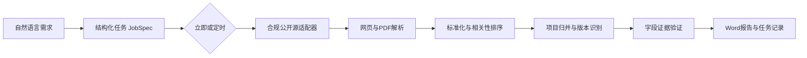

# BidRadar-X 开题补充材料底稿

## Executive Summary

- **问题不是没有公告，而是难以形成可信、持续的项目判断。** 多个平台持续发布公告，商业产品也已覆盖搜索、订阅与推送，因此新方案必须在专业相关性、跨站归并、版本变化和证据可核验上形成差异。
- **方案围绕官方硬链路做窄而深的闭环。** 自然语言输入被解析为立即或定时任务，经合规公开源采集、标准化、去重、证据验证后生成Word。
- **创新点可被量化。** 使用人工核验集评估抓取成功率、相关性Precision@10、去重F1和证据覆盖率，避免仅以Agent数量或界面效果证明创新。

## 1. 命题理解与业务场景

目标用户：服务器、液冷、算力中心和企业IT解决方案厂商的市场、销售运营或投标支持人员。

核心任务：在指定地区和时间范围内找到与业务匹配的公告，判断是否是新项目或已有项目变更，并保留可回查的原始证据。

演示场景：“每天8:30搜索上海、江苏、浙江近24小时内与服务器、液冷、算力中心有关的公告，只报告高相关或发生变化的项目并生成Word。”

## 2. 外部事实与竞品洞察

- 财政部国库司披露，2024年全国政府采购规模为33,750.43亿元，其中公开招标占76.63%。
- 中国政府采购网公开页面持续发布中央和地方的招标、更正、中标等公告，记录包含地域、采购人和发布时间等基础信息。
- 剑鱼标讯公开产品页提供区域、关键词和信息类型订阅，并通过微信、APP、邮箱推送；高级产品延伸至业主、企业、竞争对手和市场分析。
- 千里马公开介绍同样覆盖个性化订阅、智能检索和企业关系分析。

由此得出的产品判断：聚合和订阅已经是基础能力；本项目应把差异集中在垂直行业语义、同项目跨站/跨阶段归并、变化优先和字段证据链。

## 3. 解决方案与业务流程

模型只参与意图解析、非关键字段辅助提取和摘要；网络访问、任务调度、项目归并、证据核验与报告表格均采用确定性程序。

## 4. 两项创新

### 字段级证据链

每个关键字段保存值、原文片段、来源URL、抓取时间、内容哈希和验证状态。报告缺失字段显示“未知”，模型不能根据上下文补写。

### 跨站项目身份与变更雷达

结合项目编号、标题、采购人、地区和时间生成候选项目实体，把预告、招标、更正、废标和中标组织为版本时间线。定时报告优先展示新增、延期、金额或截止时间变化。

## 5. 量化验证

建立80–100条人工核验样本，至少包含跨站重复对和版本变化对。计划指标：

- 两轮各30条公开公告的抓取成功率≥90%。
- 相关性Precision@10≥80%。
- 跨站去重配对F1≥0.85。
- 报告关键事实证据覆盖率100%。
- 陌生用户从输入到下载报告≤15分钟。

所有指标均先与简单关键词/标题完全匹配基线比较；当前为验收目标，不作为已实现结果宣传。

## 6. 可行性、合规与推广

MVP只接入无需登录、无需验证码且通过来源条款与robots检查的公开页面；测试和CI使用固定样例，不实时访问站点。登录平台只预留接口，未经授权不开发。系统使用SourceAdapter和行业词库配置，可从华东算力设备推广到其他地区、医疗设备、能源或工程服务场景。

## 7. 团队分工

- 数据科学/产品负责人：行业词库、字段标准、相关性、去重、标注评测、证据规则和业务材料。
- 软件工程/平台负责人：采集适配器、解析、任务状态、调度、存储、API、Web和Word生成。
- 共同负责：公共契约、每周样本复核、端到端验收、演示与风险说明。

## 8. 提交前需要补齐的真实证据

1. 访谈3–5名销售运营、采购信息检索或投标支持相关人员。
2. 对三个候选来源做条款、robots、验证码、限速和30条小样测试。
3. 制作10–20条端到端固定样例，形成第一份Word。
4. 将用户访谈原话匿名化，只保留角色、场景、频率和痛点，不收集公司机密。

## 来源清单

- 中国政府采购网：《2024年全国政府采购简要情况》：https://www.ccgp.gov.cn/news/202511/t20251113_25686333.htm
- 中国政府采购网采购公告：https://www.ccgp.gov.cn/cggg/
- 剑鱼标讯免费订阅：https://www.jianyu360.cn/jyapp/freesubscribe/
- 剑鱼标讯产品服务：https://www.jianyu360.cn/product/index?serviceType=1
- 千里马招标网产品功能：https://www.qianlima.com/news/684.html

